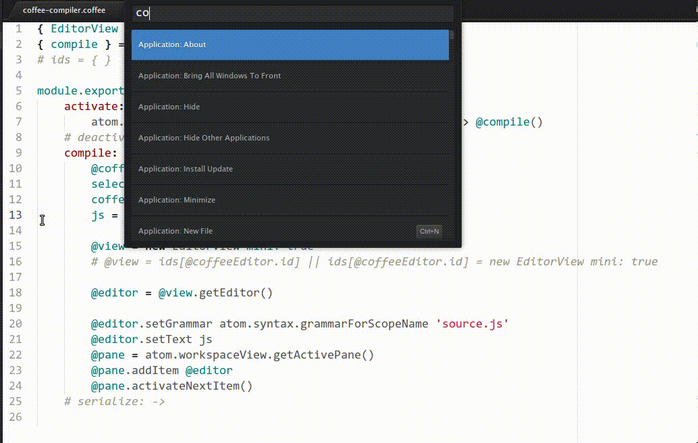

# Coffee Compiler

Quickly compile CoffeeScript code to JavaScript.

## Usage
1. Optionally select some text, if nothing is selected, the whole file will be compiled.
2. Run **Coffee Compiler: Compile** from the quick panel.
3. That's it!
